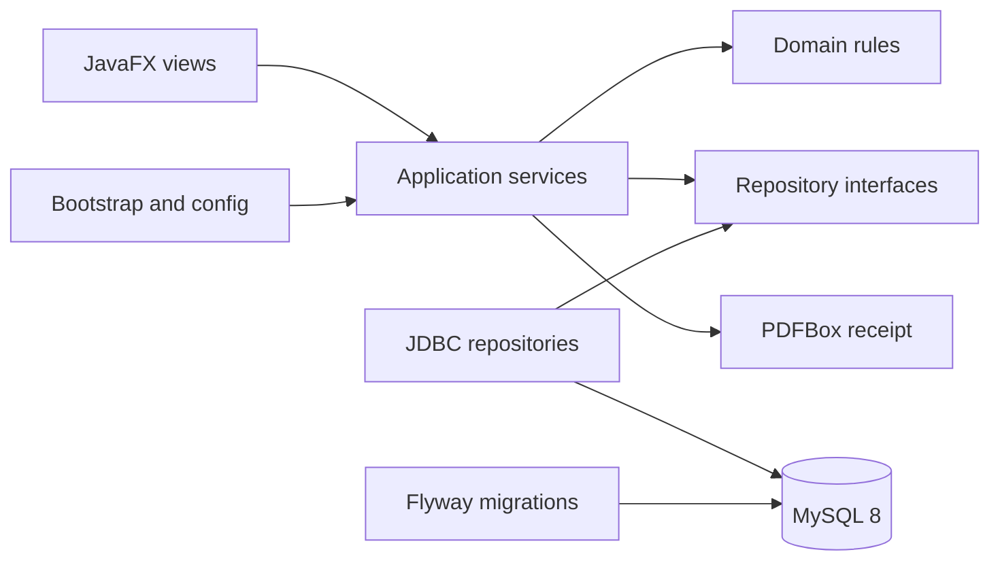
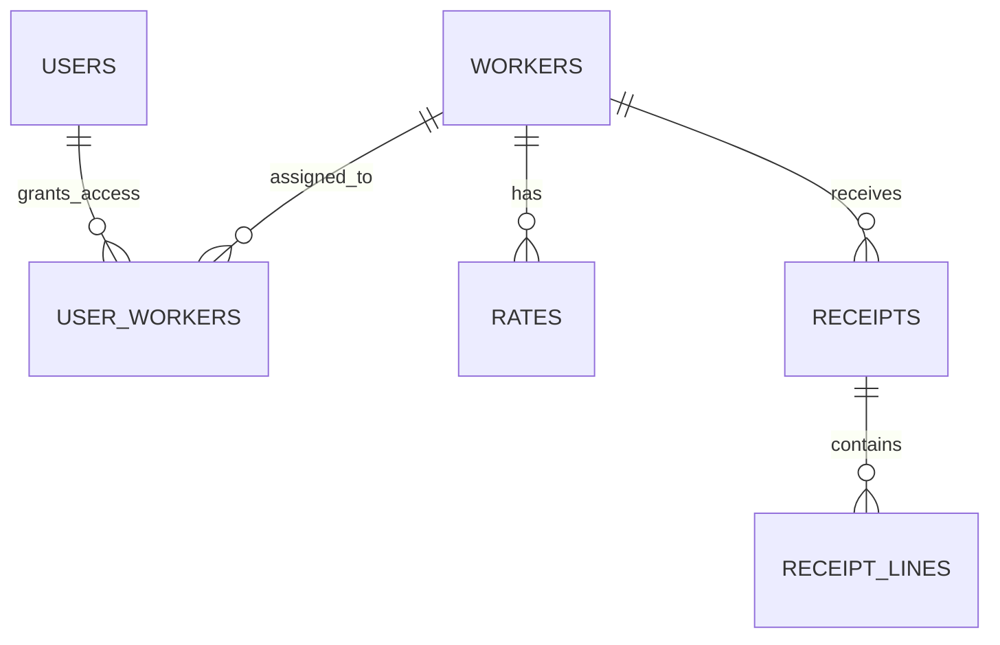
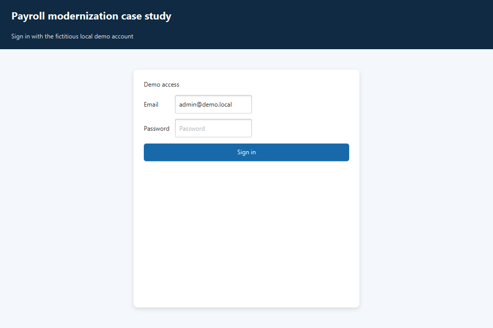
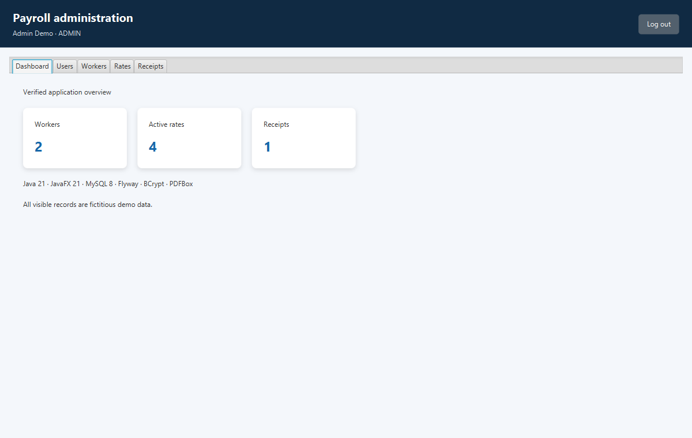
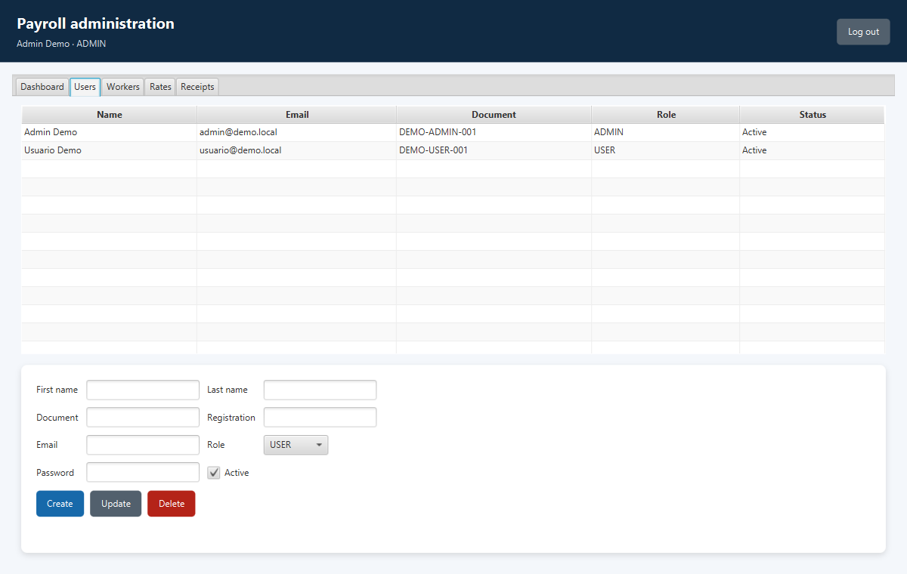
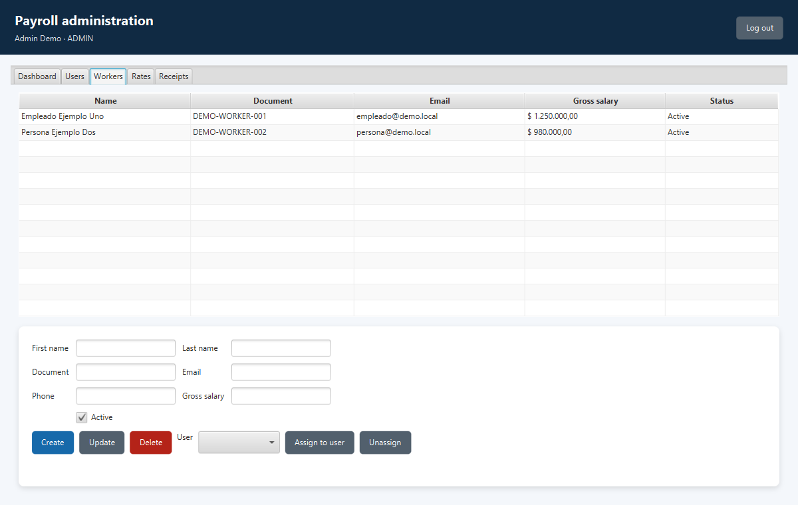
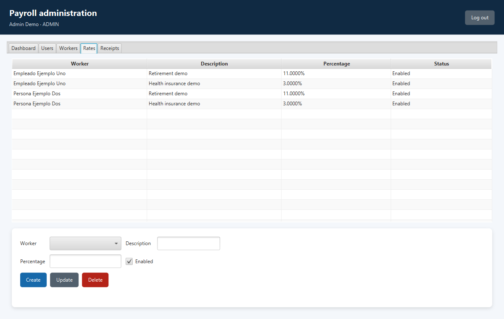
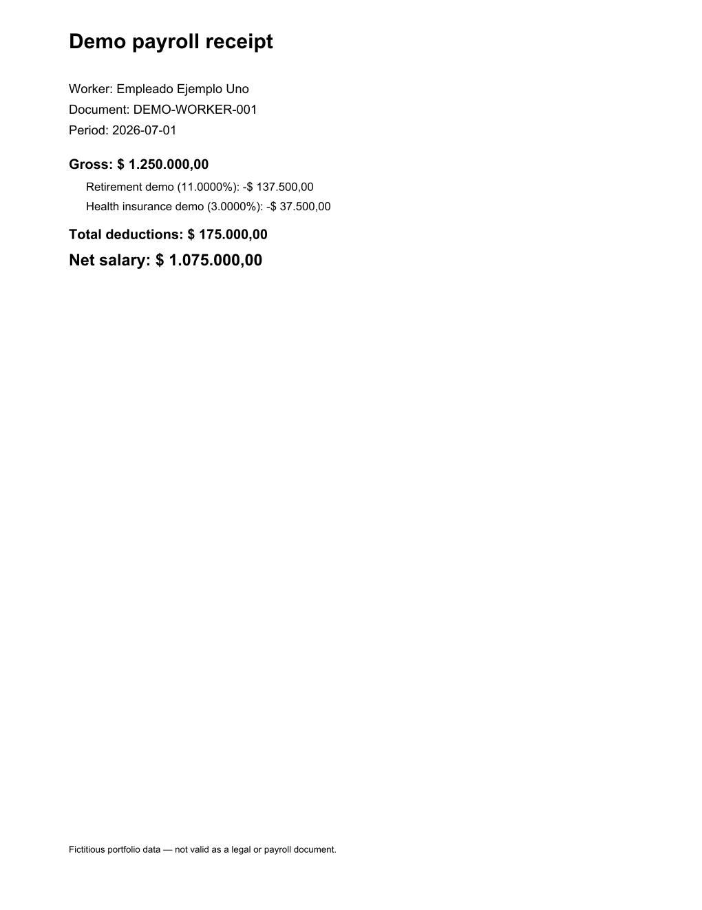

# Payroll Modernization Case Study

[](https://github.com/jmbross/sistema-liquidacion-sueldos-javafx/actions/workflows/ci.yml)
[](https://github.com/jmbross/sistema-liquidacion-sueldos-javafx/actions/workflows/codeql.yml)

A modernization and professionalization case study built from an academic JavaFX payroll application. The repository demonstrates how a legacy desktop codebase can be rebuilt around explicit domain rules, secure authentication, repeatable data migrations, automated testing, and continuous delivery—without presenting the result as a production payroll product.

## Problem and solution

The original academic iterations mixed UI, SQL, credentials, generated artifacts, and personal-looking demo records. This version replaces that foundation with a standard Maven layout, environment-driven configuration, a layered application design, fictitious seed data, BCrypt authentication, parameterized JDBC, Flyway migrations, tests, and GitHub security automation.

## Verified capabilities

- JavaFX startup, login, role-aware navigation, and logout.
- Administrator CRUD for users, workers, and deduction rates.
- User-to-worker association and read restrictions for non-admin users.
- Payroll calculation with `BigDecimal`, explicit rounding, receipt persistence, and PDF export.
- MySQL schema migration and fictitious demo data through Flyway.
- Unit and Testcontainers integration tests, JaCoCo, Spotless, and SpotBugs.

These flows were exercised by automated tests and a real application smoke run against MySQL 8.4. See [Quality evidence](#quality-evidence) and [known limitations](#known-limitations).

## Architecture



The code separates UI, application services, domain records, repository ports, JDBC adapters, configuration, and database migrations. More detail: [Architecture](docs/ARCHITECTURE.md) and [engineering decisions](docs/DECISIONS/).

### Data model



## Real application evidence

The following images are reproducible JavaFX scene snapshots generated by the application—not mockups.

| Login | Dashboard |
|---|---|
|  |  |

| Users | Workers |
|---|---|
|  |  |

| Rates | Receipt PDF |
|---|---|
|  |  |

## Technology

Java 21, JavaFX 21, Maven Wrapper, MySQL 8, HikariCP, Flyway, BCrypt, PDFBox, JUnit 5, Mockito, Testcontainers, JaCoCo, Spotless, SpotBugs, Docker Compose, GitHub Actions, CodeQL, and Dependabot.

## Run locally

Requirements: JDK 21, Docker Desktop, and PowerShell 7.

```powershell
Copy-Item .env.example .env
# Load the demo variables for this PowerShell session.
Get-Content .env | Where-Object { $_ -match '^[^#].*=' } | ForEach-Object {
  $key, $value = $_ -split '=', 2
  Set-Item -Path "Env:$key" -Value $value
}
docker compose up -d --wait
.\mvnw.cmd javafx:run
```

Reset the local database with `./database/reset.ps1`. Stop it with `docker compose down`.

### Fictitious demo access

- Administrator: `admin@demo.local` / `DemoAdmin!2026`
- User: `usuario@demo.local` / `DemoUser!2026`

The credentials are local demonstration data only. Passwords are stored as BCrypt hashes in the seed migration. Never reuse them outside this isolated environment.

## Build and test

```powershell
.\mvnw.cmd clean verify
```

The command compiles, runs unit and MySQL integration tests, checks formatting, runs SpotBugs, and generates JaCoCo HTML at `target/site/jacoco/index.html`.

Recreate visual evidence:

```powershell
.\mvnw.cmd -Pscreenshots javafx:run
```

## Quality evidence

The verified local build has zero failing tests and zero high-confidence SpotBugs findings. Integration tests use a disposable MySQL 8.4 Testcontainer and validate migrations, authentication, CRUD, access control, associations, receipt persistence, and PDF generation. CI repeats the build, wrapper validation, CodeQL, dependency review, and secret scanning. Coverage is evidence—not a substitute for behavioral assertions—and is reported in the repository workflow artifacts.

## Security

Passwords are verified in Java with BCrypt after a parameterized user lookup. Configuration comes from environment variables; SQL uses prepared statements; roles are enforced in the application service; UI errors avoid secrets and stack traces. Read [SECURITY.md](SECURITY.md) and the [threat model](docs/THREAT_MODEL.md) before considering any non-demo use.

## Engineering decisions

- Rebuild rather than mechanically merge incompatible academic iterations.
- Use repository interfaces plus JDBC adapters instead of embedding SQL in controllers.
- Use `BigDecimal` and explicit `HALF_UP` rounding for demo monetary calculations.
- Keep schema and fictitious seed data reproducible with Flyway.
- Treat AI assistance as an implementation accelerator subject to tests and human review; see [AI engineering](docs/AI_ENGINEERING.md).

## Known limitations

- This is a desktop portfolio case study, not a production payroll, accounting, tax, or legal system.
- Rules are simplified demo percentage deductions; jurisdiction-specific payroll logic is intentionally absent.
- It has no production identity provider, encryption-at-rest design, audit-log subsystem, backup automation, or multi-tenant isolation.
- GUI behavior has snapshot evidence and a startup smoke test, while most automated assertions target services and persistence rather than pixel-level interaction.
- The release is a portable Java archive with dependencies, not a native installer.

## Roadmap

Potential next steps are stronger end-to-end JavaFX interaction tests, append-only audit events, locale-aware payroll rule modules, and signed platform-specific packages. They are roadmap items, not current capabilities.

## What this modernization demonstrates

Legacy improvement is not a framework swap. It requires recovering intent, defining boundaries, removing unsafe data and build artifacts, encoding business rules, making infrastructure repeatable, and proving behavior. The project is a traceable example of that engineering process.

## Author and license

Modernization case study by Juan Manuel Brossard. Source is published for portfolio review under the restrictive terms in [LICENSE](LICENSE); third-party dependencies retain their own licenses.
