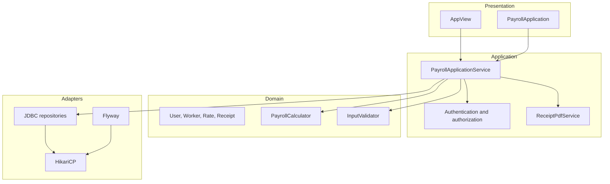

# Architecture

## Intent

The architecture makes the modernization story visible: business rules and authorization remain testable without JavaFX or MySQL, while infrastructure stays replaceable.

## Boundaries

- `domain`: immutable records and vocabulary.
- `service`: use cases, validation, authorization, calculations, password hashing, and PDF output.
- `repository`: persistence contracts.
- `repository.jdbc`: parameterized MySQL adapters and transactional receipt persistence.
- `config`: environment parsing, connection pooling, migrations, and dependency composition.
- `ui`: JavaFX scenes; no direct SQL.
- `db/migration`: reproducible schema and clearly fictitious seed data.

## Request flow

Login normalizes and validates the email, loads one user with a prepared statement, verifies BCrypt in Java, and creates a minimal immutable session. Administrative commands are checked again inside the application service. Receipt creation loads a worker and active rates, calculates `BigDecimal` amounts with two-decimal `HALF_UP` rounding, persists receipt and lines in one transaction, and exports a marked demo PDF.

## Data consistency

Database foreign keys protect assignments, rates, receipts, and lines. Email/document identifiers are unique. Receipt header and lines share a JDBC transaction. Migration state is controlled by Flyway rather than ad hoc SQL.

## Runtime topology

The JavaFX process connects through HikariCP to MySQL. Docker Compose supplies the local database only; the application itself runs on the host. Configuration is supplied through `DB_HOST`, `DB_PORT`, `DB_NAME`, `DB_USER`, and `DB_PASSWORD`.
